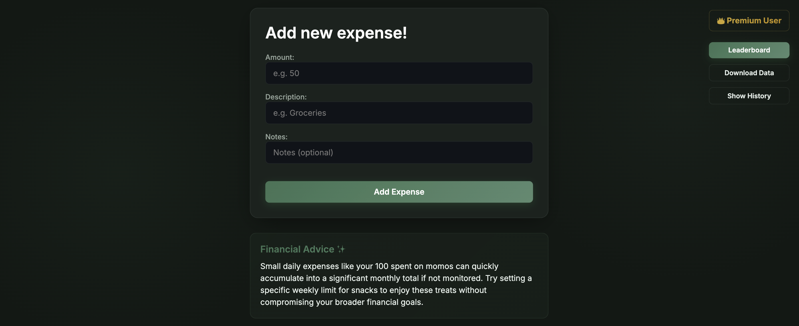

# Expense-Tracker

Expense-Tracker is a robust, full-stack personal finance application. It empowers users to easily track daily expenditures, understand where their money goes, and receive AI-driven personalized financial advice.

The backend is built with Node.js, Express, and MongoDB (via Mongoose), while the frontend uses a lightweight, fast Vanilla JavaScript architecture. Premium features like S3 data export and Leaderboards are unlocked via Cashfree payment gateway integration.

## Screenshot



## Features

- **User Authentication:** Secure JWT-based signup, login, and email-based password reset.
- **Expense Management:** Add, edit, delete, and view paginated daily expenses with notes.
- **AI Categorization:** Google Gemini AI automatically categorizes expenses based on descriptions.
- **Premium Upgrades:** Live integration with Cashfree (sandbox) for seamless payments.
- **Leaderboard:** See how your spending ranks against other users.
- **AI Financial Advisor (Premium):** Get personalized spending tips generated by Gemini AI.
- **Data Export (Premium):** Download your entire expense history securely from AWS S3, with download history tracking.

## Tech Stack

- **Runtime:** Node.js
- **Web Framework:** Express 5
- **Database:** MongoDB with Mongoose ODM
- **Authentication:** JSON Web Tokens (JWT) + bcrypt password hashing
- **AI:** Google Gemini (`@google/genai`)
- **Payments:** Cashfree (`cashfree-pg`)
- **Email:** Brevo (`@getbrevo/brevo`)
- **Cloud Storage:** AWS S3 (`aws-sdk`)
- **Logging:** Morgan
- **Frontend:** Vanilla JavaScript, HTML, CSS (served statically from `public/` and `views/`)

## Environment Setup

To run this project, you need to create a `.env` file in the root directory.

```env
PORT=3000

# Database Configuration (MongoDB)
MONGO_URI=mongodb://localhost:27017/expense_tracker

# JWT Authentication
TOKEN_SECRET=your_super_secret_jwt_key

# Email Service (Brevo)
BREVO_API_KEY=your_brevo_api_key
BREVO_SENDER_EMAIL=noreply@yourdomain.com
BASE_URL=http://localhost:3000

# Payment Gateway (Cashfree - Sandbox)
CASHFREE_APPID=your_cashfree_app_id
CASHFREE_SECRETKEY=your_cashfree_secret_key

# AI Integration (Google Gemini)
GEMINI_API_KEY=your_gemini_api_key

# Cloud Storage (AWS S3)
AWS_ACCESS_KEY_ID=your_aws_key
AWS_SECRET_ACCESS_KEY=your_aws_secret
AWS_BUCKET_NAME=your_bucket_name
```

## Installation

1. Clone the repository:
   ```bash
   git clone <repository-url>
   cd Expense-Tracker
   ```

2. Install dependencies:
   ```bash
   npm install
   ```

3. Ensure you have a MongoDB instance running (local or a hosted MongoDB Atlas cluster) and set `MONGO_URI` in your `.env` accordingly.

4. Start the application:
   ```bash
   npm start
   ```

The server connects to MongoDB on startup and listens on `http://localhost:3000` (or the `PORT` you configure).

## Scripts

- `npm start`: Starts the application using Node.js (`node app.js`).
- `npm test`: Currently exits with an error (no test runner specified).

## Usage

1. Open your browser and navigate to `http://localhost:3000/`.
2. Click **Sign Up** to create a new account.
3. Log in to reach the **Expense Dashboard** (`/expense`).
4. Add your daily expenses by entering an amount, description, and optional notes. The AI will categorize each expense automatically.
5. Click **Upgrade to Premium** to test the payment gateway flow and unlock the AI Financial Advisor and Data Download features. (The Leaderboard is publicly viewable.)

## API Overview

For comprehensive documentation covering exact parameters, return types, and application flow, please refer to the `TECHNICAL_DOCUMENTATION.md` file in the project root.

### Public Routes
- `POST /user/signup`: Register a new user.
- `POST /user/login`: Authenticate and receive a JWT.
- `POST /password/forgot-password`: Send a reset link via email.
- `POST /password/reset-password/:uuid`: Reset the password using the emailed link token.
- `GET /leaderboard/`: Fetch users ranked by total spending.

### Protected Routes (Requires `Authorization` header with JWT)
- `GET /user/me`: Get the current user's name and premium status.
- `POST /expense/add-expense`: Add a new expense (auto-categorized by AI).
- `GET /expense/get-expenses?page=1&limit=5`: Retrieve paginated expenses with totals.
- `PUT /expense/edit-expense/:id`: Modify an existing expense.
- `DELETE /expense/delete-expense/:id`: Remove an expense.
- `POST /payment/create-payment-order`: Initialize a Cashfree order.
- `POST /payment/verify-payment`: Verify a payment and activate premium.

### Premium Routes (Requires JWT & `isPremium` status)
- `GET /expense/insights`: Get AI-generated financial advice.
- `GET /expense/download`: Generate an S3 download link for all expense data.
- `GET /expense/download-history`: List previously generated download links.

## Project Structure

```
Expense-Tracker/
├── app.js                 # Express app entry point, routes, static serving
├── controllers/           # Request handlers (expense, user, payment, leaderboard, forgotPass)
├── models/                # Mongoose schemas (User, Expense, Order, DownloadHistory, ForgotPasswordRequest)
├── routes/                # Express routers
├── services/              # External integrations (aiService, awsS3Service, cashfreeservice, brevoService)
├── middleware/            # JWT authentication middleware
├── utils/                 # MongoDB connection helper
├── views/                 # Static HTML pages
├── public/                # Client-side JS and CSS
└── assets/                # README assets (screenshots)
```

## Deployment

1. Set up a cloud instance (e.g., AWS EC2, DigitalOcean Droplet) with Node.js installed, and a reachable MongoDB instance (self-hosted or MongoDB Atlas).
2. Clone the repository onto the server.
3. Configure your production `.env` variables (production `MONGO_URI` and Cashfree production credentials).
4. Install `pm2` globally: `npm install -g pm2`.
5. Start the application with PM2 for background execution and crash recovery: `pm2 start app.js --name "expense-tracker"`.
6. Configure Nginx as a reverse proxy to forward port 80/443 traffic to port 3000.
